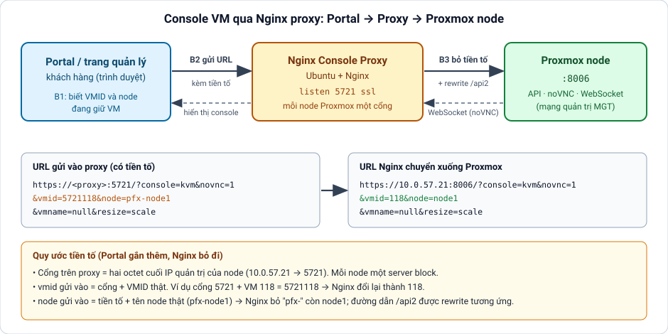

# Cấu hình Nginx proxy console cho VM Proxmox (noVNC qua portal)

[← Mục lục](../../README.md) · Runbook

**Mục tiêu:** Cho kỹ thuật hoặc khách hàng thao tác console VM ngay trên portal hoặc trang quản lý dịch vụ mà không phải mở thẳng giao diện Proxmox. Portal gửi URL kèm tiền tố tới Nginx proxy, Nginx bỏ tiền tố, rewrite đường dẫn API rồi chuyển xuống đúng node Proxmox (cổng 8006); mỗi node ứng với một cổng riêng trên proxy.

**Điều kiện trước khi làm:** Một server Ubuntu cài Nginx, có ít nhất một NIC định tuyến thông tới mạng quản trị (MGT) của cluster Proxmox; chứng chỉ SSL cho domain proxy; một user Proxmox riêng cho portal (không dùng root) có quyền console.



## Các bước

1. Hiểu quy ước đặt tên trước khi cấu hình: mỗi node một cổng trên proxy, cổng bằng hai octet cuối IP quản trị (10.0.57.21 thành 5721). Portal gửi vmid = cổng + VMID thật (cổng 5721, VM 118 thành 5721118) và node = tiền tố + tên node (pfx-node1). Nginx bỏ phần tiền tố trước khi chuyển xuống Proxmox.

2. Cài Nginx và tạo thư mục chứa snippet và script

```bash
apt update && apt install nginx -y
mkdir -p /etc/nginx/snippets /var/www/proxmox-inject
nginx -v
```

3. File websocket-proxy.conf: tùy chọn proxy cho WebSocket (bắt buộc để noVNC chạy)

**`/etc/nginx/conf.d/websocket-proxy.conf`**

```nginx
proxy_http_version 1.1;
proxy_set_header Upgrade $http_upgrade;
proxy_set_header Connection "upgrade";
proxy_redirect off;
proxy_buffering off;
proxy_connect_timeout 3600s;
proxy_read_timeout 3600s;
proxy_send_timeout 3600s;
```

4. File ssl.conf: cấu hình SSL dùng chung cho mọi server block

**`/etc/nginx/conf.d/ssl.conf`**

```nginx
# Dùng chung cho mọi server block. Chứng chỉ khai báo trong từng server block.
# Bản gốc dùng TLSv1/1.1 và RC4 (đã lỗi thời); mẫu này nâng lên TLS 1.2/1.3.
ssl_protocols TLSv1.2 TLSv1.3;
ssl_ciphers HIGH:!aNULL:!MD5;
ssl_prefer_server_ciphers on;
ssl_verify_client off;
ssl_session_cache shared:SSL:10m;
```

5. File console.conf: một server block cho mỗi node. Đổi cổng, IP node, tiền tố, domain và đường dẫn chứng chỉ; nhân bản khối này cho các node còn lại (cổng 5722 tới node thứ hai, v.v.)

**`/etc/nginx/conf.d/console.conf`**

```nginx
# Mẫu cho MỘT node Proxmox. Nhân bản khối server cho mỗi node, đổi:
#   5721          -> cổng của node (hai octet cuối IP quản trị: 10.0.57.21 -> 5721)
#   10.0.57.21    -> IP quản trị của node
#   pfx-          -> tiền tố tên node mà portal gắn vào
#   console.example.com và đường dẫn chứng chỉ -> của anh
server {
    listen 5721 ssl;

    include /etc/nginx/conf.d/websocket-proxy.conf;
    include /etc/nginx/conf.d/ssl.conf;
    include /etc/nginx/snippets/paste-widget.conf;       # tùy chọn: phục vụ /custom/paste.js

    server_name console.example.com www.console.example.com;

    error_log /var/log/nginx/proxy-error.log warn;

    ssl_certificate     /etc/nginx/example.com.crt;      # đường dẫn file cert
    ssl_certificate_key /etc/nginx/example.com.key;      # đường dẫn file key

    client_max_body_size 0;
    rewrite_log on;

    location / {
        include /etc/nginx/snippets/paste-inject.conf;   # tùy chọn: chèn nút Paste vào trang

        # Bỏ tiền tố cổng khỏi vmid: vmid=5721118 -> vmid=118
        if ($args ~ (.*)(vmid=5721)(.*)) {
            set $args $1vmid=$3;
        }
        # Bỏ tiền tố khỏi tên node: node=pfx-node1 -> node=node1
        if ($args ~ (.*)(node=pfx-)(.*)) {
            set $args $1node=$3;
        }

        proxy_pass https://10.0.57.21:8006/?$args;

        location /pve/ {
            proxy_pass https://10.0.57.21:8006/pve/;
        }

        location /api2 {
            # VM (qemu)
            rewrite /api2/(.*)/nodes/pfx-(.*)/qemu/5721(\w+)\.?.*/status/current /api2/$1/nodes/$2/qemu/$3/status/current break;
            rewrite /api2/(.*)/nodes/pfx-(.*)/qemu/5721(\w+)\.?.*/vncproxy       /api2/$1/nodes/$2/qemu/$3/vncproxy break;
            rewrite /api2/(.*)/nodes/pfx-(.*)/qemu/5721(\w+)\.?.*/vncwebsocket   /api2/$1/nodes/$2/qemu/$3/vncwebsocket break;
            # Container (lxc)
            rewrite /api2/(.*)/nodes/pfx-(.*)/lxc/5721(\w+)\.?.*/status/current  /api2/$1/nodes/$2/lxc/$3/status/current break;
            rewrite /api2/(.*)/nodes/pfx-(.*)/lxc/5721(\w+)\.?.*/vncproxy        /api2/$1/nodes/$2/lxc/$3/vncproxy break;
            rewrite /api2/(.*)/nodes/pfx-(.*)/lxc/5721(\w+)\.?.*/vncwebsocket    /api2/$1/nodes/$2/lxc/$3/vncwebsocket break;

            proxy_pass https://10.0.57.21:8006;
        }

        location /novnc/ {
            proxy_pass https://10.0.57.21:8006/novnc/;
        }
    }
}
```

6. Tùy chọn, tính năng Paste: nút gửi text vào VM dưới dạng gõ phím. Gồm hai snippet Nginx và một file JavaScript

**`/etc/nginx/snippets/paste-widget.conf`**

```nginx
# Cần để sub_filter đọc được HTML (không để upstream nén gzip)
proxy_set_header Accept-Encoding "";

location = /custom/paste.js {
    alias /var/www/proxmox-inject/paste.js;
    add_header Cache-Control "no-cache";
}
```

**`/etc/nginx/snippets/paste-inject.conf`**

```nginx
sub_filter '</body>' '<script src="/custom/paste.js"></script></body>';
sub_filter_once on;
```

**`/var/www/proxmox-inject/paste.js`**

```javascript
(function () {
  'use strict';

  // ---- 1. Bảng map ký tự -> {code, keyCode, shiftKey} theo layout US QWERTY ----
  const MAP = {};
  for (let i = 0; i < 26; i++) {
    const upper = String.fromCharCode(65 + i);
    const lower = String.fromCharCode(97 + i);
    const keyCode = 65 + i;
    const code = 'Key' + upper;
    MAP[lower] = { code, keyCode, shiftKey: false, key: lower };
    MAP[upper] = { code, keyCode, shiftKey: true, key: upper };
  }
  const DIGIT_ROW = [
    ['0', ')'], ['1', '!'], ['2', '@'], ['3', '#'], ['4', '$'],
    ['5', '%'], ['6', '^'], ['7', '&'], ['8', '*'], ['9', '('],
  ];
  DIGIT_ROW.forEach(([plain, shifted], i) => {
    const code = 'Digit' + plain;
    const keyCode = 48 + i;
    MAP[plain] = { code, keyCode, shiftKey: false, key: plain };
    MAP[shifted] = { code, keyCode, shiftKey: true, key: shifted };
  });
  const PUNCT = [
    ['-', '_', 'Minus', 189], ['=', '+', 'Equal', 187],
    ['[', '{', 'BracketLeft', 219], [']', '}', 'BracketRight', 221],
    ['\\', '|', 'Backslash', 220], [';', ':', 'Semicolon', 186],
    ["'", '"', 'Quote', 222], ['`', '~', 'Backquote', 192],
    [',', '<', 'Comma', 188], ['.', '>', 'Period', 190],
    ['/', '?', 'Slash', 191],
  ];
  PUNCT.forEach(([plain, shifted, code, keyCode]) => {
    MAP[plain] = { code, keyCode, shiftKey: false, key: plain };
    MAP[shifted] = { code, keyCode, shiftKey: true, key: shifted };
  });
  MAP[' '] = { code: 'Space', keyCode: 32, shiftKey: false, key: ' ' };

  // ---- 2. Tìm canvas mà noVNC đang render màn hình VM ----
  function findTarget() {
    const canvas = document.querySelector('canvas');
    return canvas || document.body;
  }

  // ---- 3. Bắn 1 sự kiện bàn phím tổng hợp ----
  function fireKey(target, type, info) {
    const ev = new KeyboardEvent(type, {
      key: info.key,
      code: info.code,
      keyCode: info.keyCode,
      which: info.keyCode,
      shiftKey: info.shiftKey,
      bubbles: true,
      cancelable: true,
      composed: true,
    });
    // Một số browser coi keyCode/which là getter tính sẵn -> ép lại cho chắc
    try {
      Object.defineProperty(ev, 'keyCode', { get: () => info.keyCode });
      Object.defineProperty(ev, 'which', { get: () => info.keyCode });
    } catch (e) { /* ignore nếu browser không cho override */ }
    target.dispatchEvent(ev);
  }

  function sendChar(target, ch) {
    if (ch === '\n' || ch === '\r') {
      const info = { code: 'Enter', keyCode: 13, shiftKey: false, key: 'Enter' };
      fireKey(target, 'keydown', info);
      fireKey(target, 'keyup', info);
      return;
    }
    const info = MAP[ch];
    if (!info) return; // ký tự không nằm trong bảng US QWERTY -> bỏ qua
    if (info.shiftKey) fireKey(target, 'keydown', { code: 'ShiftLeft', keyCode: 16, shiftKey: true, key: 'Shift' });
    fireKey(target, 'keydown', info);
    fireKey(target, 'keyup', info);
    if (info.shiftKey) fireKey(target, 'keyup', { code: 'ShiftLeft', keyCode: 16, shiftKey: false, key: 'Shift' });
  }

  async function sendText(text) {
    const target = findTarget();
    if (target.focus) target.focus();
    // click giả để noVNC nhận biết canvas đang được tương tác (một số bản cần focus thật)
    target.dispatchEvent(new MouseEvent('mousedown', { bubbles: true }));
    target.dispatchEvent(new MouseEvent('mouseup', { bubbles: true }));
    for (const ch of text) {
      sendChar(target, ch);
      await new Promise((r) => setTimeout(r, 8)); // giãn nhẹ giữa các phím tránh mất ký tự
    }
  }

  // ---- 4. UI: nút Paste + hộp thoại nhập text ----
  function buildDialog() {
    const overlay = document.createElement('div');
    overlay.id = 'custom-paste-overlay';
    Object.assign(overlay.style, {
      position: 'fixed', inset: '0', background: 'rgba(0,0,0,.5)',
      zIndex: 999999, display: 'none', alignItems: 'center', justifyContent: 'center',
    });
    const box = document.createElement('div');
    Object.assign(box.style, {
      background: '#fff', padding: '16px', borderRadius: '6px',
      width: '420px', maxWidth: '90vw', boxShadow: '0 4px 20px rgba(0,0,0,.3)',
      fontFamily: 'sans-serif',
    });
    box.innerHTML = `
      <div style="font-weight:600;margin-bottom:8px;">Gửi text tới VM (dạng gõ phím)</div>
      <textarea id="custom-paste-textarea" rows="6" style="width:100%;box-sizing:border-box;
        font-family:monospace;padding:6px;" placeholder="Dán nội dung vào đây..."></textarea>
      <div style="margin-top:10px;text-align:right;">
        <button id="custom-paste-cancel" style="margin-right:8px;">Hủy</button>
        <button id="custom-paste-send" style="background:#2b6cb0;color:#fff;border:0;
          padding:6px 14px;border-radius:4px;cursor:pointer;">Gửi</button>
      </div>
      <div style="font-size:11px;color:#888;margin-top:6px;">
        Lưu ý: chỉ hỗ trợ ký tự ASCII theo bàn phím US (chữ, số, dấu câu thông dụng).
      </div>`;
    overlay.appendChild(box);
    document.body.appendChild(overlay);

    overlay.querySelector('#custom-paste-cancel').onclick = () => {
      overlay.style.display = 'none';
    };
    overlay.querySelector('#custom-paste-send').onclick = async () => {
      const text = overlay.querySelector('#custom-paste-textarea').value;
      overlay.style.display = 'none';
      if (text) await sendText(text);
    };
    return overlay;
  }

  function addButton() {
    if (document.getElementById('custom-paste-btn')) return;
    const btn = document.createElement('button');
    btn.id = 'custom-paste-btn';
    btn.textContent = 'Paste';
    btn.title = 'Gửi text tới VM dưới dạng gõ phím';
    Object.assign(btn.style, {
      position: 'fixed', top: '8px', right: '90px', zIndex: 999998,
      padding: '4px 10px', fontSize: '13px', cursor: 'pointer',
      background: '#2b6cb0', color: '#fff', border: 0, borderRadius: '4px',
    });
    const overlay = buildDialog();
    btn.onclick = () => {
      overlay.style.display = 'flex';
      overlay.querySelector('#custom-paste-textarea').focus();
    };
    document.body.appendChild(btn);
  }

  function init() {
    addButton();
    let tries = 0;
    const t = setInterval(() => {
      addButton();
      if (++tries > 10) clearInterval(t);
    }, 1000);
  }

  if (document.readyState === 'loading') {
    document.addEventListener('DOMContentLoaded', init);
  } else {
    init();
  }
})();
```

7. Kiểm tra cú pháp rồi nạp lại cấu hình (reload không ngắt các phiên console đang mở, restart thì có)

```bash
nginx -t
systemctl reload nginx
ss -tulpn | grep nginx
```

8. Tạo user Proxmox riêng cho portal và cấp quyền console (không dùng root@pam)

```bash
pveum user add portal@pve --password <password>
pveum acl modify /vms --users portal@pve --roles PVEVMConsole
pveum acl list
```

9. Khai báo trên portal. Portal v1: mục quản lý Proxmox, điền Url Proxy là domain proxy, ParamUrl là /?console=kvm&novnc=1&resize=scale, Realm PVE, user portal, và ô Port theo cấu trúc JSON {"tên host":"cổng"} cách nhau dấu phẩy. Portal v2: mục Cloud > Host > Đồng bộ node theo đúng cluster, rồi nhập Port cho từng host (hai octet cuối IP quản trị, ví dụ 10.0.12.47 thành 1247)

```bash
{"node1":"5721","node2":"5722","node3":"5723"}
```

10. Kiểm tra: mở một VM nằm trên host vừa thêm, bấm Remote Console, thấy màn hình VM là đạt. Nếu lỗi, xem log rồi làm theo runbook lấy ticket và gỡ lỗi bằng F12

```bash
tail -f /var/log/nginx/proxy-error.log
```

## Lưu ý

Cấu hình mẫu đã được thử trên một Nginx thật với node Proxmox giả: tiền tố vmid và node bị bỏ đúng, ba đường API (status/current, vncproxy, vncwebsocket) cho cả VM lẫn container được rewrite đúng, nút Paste được chèn vào trang; chưa thử với Proxmox thật. Các giá trị trong mẫu (domain, IP, tiền tố pfx-, tên chứng chỉ) là ví dụ, anh thay bằng của mình. ssl.conf gốc dùng TLSv1/1.1 và cipher RC4, mẫu này nâng lên TLS 1.2/1.3: nên thử với các client cần dùng. Chứng chỉ có hạn dùng và nginx -t không báo hết hạn, hãy đặt lịch kiểm tra: openssl x509 -enddate -noout -in <file.crt>. Tính năng Paste chỉ gõ được ký tự ASCII theo bàn phím US. Tài liệu gốc ghi nhầm tên file thứ tư là paste-inject.conf, thực chất đó là paste.js (nội dung sao lại từ PDF nên cần đối chiếu với file thật trên server). Nginx cần các dòng if chỉ để đổi $args, đừng thêm logic phức tạp vào location.

<!-- từ khóa: runbook console proxy nginx novnc vncproxy vncwebsocket websocket portal vmid node tiền tố prefix cổng port rewrite paste sub_filter ssl 8006 remote console -->
