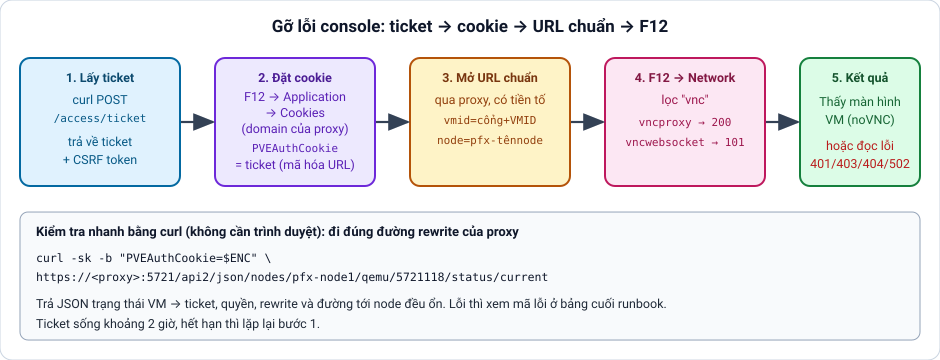

# Gỡ lỗi console: lấy ticket qua API, áp cookie, mở URL chuẩn rồi kiểm tra bằng F12

[← Mục lục](../../README.md) · Runbook

**Mục tiêu:** Kiểm tra từng chặng của đường console (Proxmox, proxy, trình duyệt) mà không cần portal: tự lấy ticket đăng nhập, áp vào trình duyệt, mở URL chuẩn qua proxy và dùng DevTools (F12) để thấy chặng nào lỗi.

**Điều kiện trước khi làm:** Một user Proxmox có quyền console (ví dụ portal@pve); biết IP node, cổng proxy, tiền tố node và VMID. Lưu ý root@pam có thể đã bị tắt đăng nhập trên cluster, khi đó dùng user riêng. API token dùng cho script gọi API, thường không thay được cookie đăng nhập của trình duyệt nên không dùng được cho bước này.



## Các bước

1. Lấy ticket từ API của node (chạy từ máy proxy hoặc máy có route tới node). Dạng lệnh cơ bản, thay user, realm, mật khẩu và IP node

```bash
curl -k -d 'username=<user>@<realm>' --data-urlencode 'password=<password>' https://<node-ip>:8006/api2/json/access/ticket
```

2. Kết quả là JSON: data.ticket (chuỗi dạng PVE:user@realm:...) và data.CSRFPreventionToken. Cách an toàn hơn, nhập mật khẩu bằng biến để không lưu vào history, rồi tách ticket ra và mã hóa URL để dùng làm cookie

```bash
read -rs PW
TICKET=$(curl -sk -d "username=<user>@<realm>" --data-urlencode "password=$PW" https://<node-ip>:8006/api2/json/access/ticket | jq -r .data.ticket)
ENC=$(python3 -c 'import sys,urllib.parse;print(urllib.parse.quote(sys.argv[1],safe=""))' "$TICKET")
echo "$ENC"
```

3. Kiểm tra nhanh chặng proxy bằng curl, chưa cần trình duyệt: gọi trạng thái VM qua proxy với đường dẫn có tiền tố. Trả JSON trạng thái VM nghĩa là ticket, quyền, rewrite và đường tới node đều ổn

```bash
curl -sk -b "PVEAuthCookie=$ENC" "https://<proxy-domain>:<port>/api2/json/nodes/<prefix>-<node-name>/qemu/<port><vmid>/status/current"
```

4. Áp ticket vào trình duyệt: mở https://<proxy-domain>:<port>/ (chấp nhận chứng chỉ nếu cần), nhấn F12 > Application > Cookies > chọn domain proxy, thêm cookie PVEAuthCookie với giá trị đã mã hóa, Path /. Hoặc chạy lệnh sau trong tab Console của F12

```bash
document.cookie = "PVEAuthCookie=" + encodeURIComponent("<ticket>") + "; path=/; Secure"
```

5. Mở URL chuẩn qua proxy: vmid = cổng + VMID thật, node = tiền tố + tên node

```bash
https://<proxy-domain>:<port>/?console=kvm&novnc=1&vmid=<port><vmid>&vmname=null&node=<prefix>-<node-name>&resize=scale
```

6. F12 > Network, tải lại trang, lọc theo vnc. Đúng khi vncproxy trả 200, vncwebsocket trả 101 Switching Protocols và tab Console không có lỗi đỏ. Cookie PVEAuthCookie nằm ở F12 > Application > Cookies của domain proxy, đây cũng là cookie mà portal tự đặt khi mở console

7. Phía proxy: xem log lỗi và kiểm tra cấu hình khi cần

```bash
tail -f /var/log/nginx/proxy-error.log
nginx -t
```

## Lưu ý

Cách đọc lỗi: 401 là ticket hết hạn (sống khoảng 2 giờ) hoặc sai realm; 403 là user thiếu quyền VM.Console (xem pveum acl list); 404 trên /api2 là rewrite không khớp, thường do sai tiền tố vmid hoặc node so với server block của cổng đó; 502 là Nginx không tới được node cổng 8006; vncwebsocket không lên 101 hoặc đứt ngay là thiếu header Upgrade/Connection hoặc bật buffering trong websocket-proxy.conf; màn hình đen hoặc báo không kết nối là vncproxy chưa 200 hoặc VM chưa chạy. Ticket và mật khẩu không gửi lên nơi công cộng, test xong nên xóa cookie. Nếu cluster tắt đăng nhập root@pam, lệnh lấy ticket bằng root sẽ báo lỗi xác thực, đó là bình thường.

<!-- từ khóa: runbook console ticket api access ticket pveauthcookie cookie f12 devtools url chuẩn vncproxy vncwebsocket 401 403 502 gỡ lỗi proxy portal curl csrf -->
